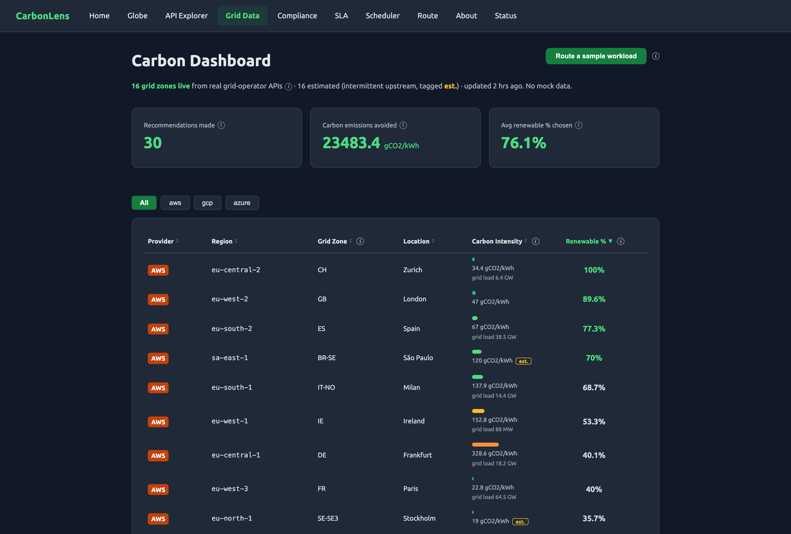

# CarbonLens

**Measure and cut the carbon footprint of your cloud compute.**

*Live carbon-intensity data for 75+ cloud regions — see which grid is greenest right now, route workloads to it, and report on it.*

**🌍 [Live demo →](https://carbonlens.peterklingelhofer.workers.dev/globe)**


<sub>Each glowing beam is a cloud region at its datacenter location, colored by **live** grid carbon intensity (green = clean → red = dirty) and sized by renewable share. Real grid-operator data, estimated ones are labeled.</sub>



<sub>The data behind it — a live carbon-intensity dashboard pulling real EIA / ENTSO-E / UK / AEMO feeds, every reading tagged with its source. More screens: [API Explorer](docs/screenshots/03-api-explorer.png) · [Carbon-aware routing](docs/screenshots/04-route.png) · [Compliance](docs/screenshots/06-compliance.png)</sub>

CarbonLens aggregates electricity-grid carbon data into one cascading API: eight live grid-operator integrations (UK, EIA, OpenElectricity/AEMO, IESO/AESO, Taipower, GridStatus, ENTSO-E, Electricity Maps) with heuristic and mock fallbacks, each tagged in the `source` field so you always know how a number was produced. On top sit consumption-based (flow-traced) and marginal intensity, carbon-aware routing and scheduling, GHG-Protocol Scope 2/3 compliance reporting, and Green SLA monitoring.

> **Status:** portfolio / demo project, not a production service. See [What's real vs. estimated vs. mock](#whats-real-vs-estimated-vs-mock) for which parts are live integrations and which are stubs.

## Why This Exists

Every major cloud claims "100% renewable" — mostly via **annual REC matching**, buying credits at noon to offset coal burned at midnight. CarbonLens surfaces the underlying grid numbers instead: live gCO2/kWh where a real grid-operator API exists, a labeled heuristic or mock value where it doesn't, so provenance is always visible.

---

## Quick Start

**1. First-time setup** (installs deps, copies `.env`, builds the frontend):

```bash
git clone https://github.com/peterklingelhofer/carbonlens.git
cd carbonlens
make setup
```

**2. Run it** — one command, starts the API and the frontend with hot reload:

```bash
make dev
```

**3. Open it in your browser:**

| What to show | URL |
|--------------|-----|
| 🌍 **Carbon globe** — start here | **http://localhost:5173/globe** |
| Live dashboard | http://localhost:5173/dashboard |
| Landing page | http://localhost:5173 |
| Interactive API Explorer | http://localhost:5173/api-explorer |
| Swagger API docs | http://localhost:8000/docs |

Runs with **no API keys** — several live grid sources work key-free (UK, Australia, Canada, Taiwan); any region without a live source returns labeled fallback data. (Add keys to `.env` for US/EU coverage; see [Adding Credentials](#adding-credentials).)

### Try the API

```bash
# Get carbon intensity for AWS us-east-1 right now
curl http://localhost:8000/api/v1/carbon/aws/us-east-1

# Find the greenest region across all providers
curl -X POST http://localhost:8000/api/v1/route \
  -H "Content-Type: application/json" \
  -d '{"constraints": {"providers": ["aws", "gcp", "azure"], "carbon_weight": 1.0}}'

# Batch query multiple regions
curl -X POST http://localhost:8000/api/v1/carbon/batch \
  -H "Content-Type: application/json" \
  -d '[{"provider": "aws", "region": "us-east-1"}, {"provider": "gcp", "region": "europe-north1"}]'
```

---

## Products

### 1. Carbon Intensity API
Electricity-grid carbon data for 75+ cloud regions, behind one cascading interface — 8 live grid-operator integrations plus labeled heuristic and mock fallbacks. Beyond the headline production-based intensity, it also exposes a flow-traced **consumption-based** intensity for the interconnected European grid and an estimated **marginal** intensity (the price-setting fuel) for load-shifting decisions.

### 2. Compliance Reporting
GHG-Protocol Scope 2 (location-based) + Scope 3 Cat 1 emissions reporting for cloud workloads, aimed at CSRD / SEC Climate / SB 253 workflows. Documented methodology, data-quality summary, JSON/CSV export.

You supply the usage data (it isn't auto-detected); CarbonLens maps service+region → energy (Cloud Carbon Footprint coefficients) → emissions via live grid intensity. Three inputs: a `mock` demo payload, manual CSV upload, or live cloud-billing adapters (AWS Cost Explorer, GCP BigQuery export, Azure Cost Management — `uv sync --extra cloud`).

> Scope: a structured *first draft*, not an assured report. Market-based accounting, supplier-specific Scope 3 factors, utilization-aware modeling, and signed PDFs are not implemented (see [roadmap](#whats-next)). The billing adapters are coded-to-spec and mock-tested, **not** verified against live accounts.

### 3. Carbon-Aware Routing & Scheduling
Route workloads to the greenest cloud region in real-time, or shift them in time to the cleanest upcoming window. Works with AWS, GCP, and Azure plus the EU-heavy independents Scaleway, OVHcloud, and Hetzner (which reuse the same grid zones, so they get real carbon data with no new integration). For European zones the scheduler projects the renewable share from ENTSO-E's real day-ahead wind/solar/load forecast; elsewhere it falls back to a labeled time-of-day model.

### 4. Green SLA Monitoring (Beta)
Define carbon targets, run on-demand and scheduled compliance checks against live grid data, and generate attestation-style summary reports. SLA definitions, checks, and reports **persist to Postgres** when a database is configured (`CARBON_LENS_USE_DATABASE=true`), so they survive restarts; without one they fall back to in-memory (the keyless demo). Durable *scheduled* checking uses a GitHub Actions cron that POSTs to an admin-only `/sla/monitor/run` endpoint (see [`sla-monitor.yml`](.github/workflows/sla-monitor.yml)) — that works even on a scale-to-zero host, unlike the in-process loop which only runs while the API is awake. Note: the "attestation" format is a self-defined summary, not an assured third-party standard.

---

## Data Sources

CarbonLens cascades through 13 providers, using the highest-priority source that covers each grid zone. The **Type** column is the honest part: only `Live API` providers fetch and parse a real grid-operator response.

| # | Provider | Coverage | Type | Auth |
|---|----------|----------|------|------|
| 1 | UK Carbon Intensity | UK (18 zones) | **Live API** (renewable % estimated) | Free, no key |
| 2 | EIA (US DOE) | US (60+ balancing authorities) | **Live API** (intensity from fuel mix) | Free key |
| 3 | OpenElectricity (AEMO) | Australia (5 states) | **Live API** (fuel mix) | Free, no key |
| 4 | IESO & AESO | Canada (Ontario, Alberta) | **Live API** (fuel mix; Québec heuristic) | Free, no key |
| 5 | Taipower | Taiwan | **Live API** (per-unit fuel mix) | Free, no key |
| 6 | Grid India | India (5 regions) | Heuristic fallback | Free, no key |
| 7 | ONS Brazil | Brazil (5 regions) | Heuristic fallback | Free, no key |
| 8 | Eskom | South Africa | Heuristic (time-of-day model) | Free, no key |
| 9 | GridStatus.io | US ISOs (7) | **Live API** | Paid key |
| 10 | ENTSO-E | Europe (36+ countries) | **Live API** (IEC-62325 XML) | Free token |
| 11 | Open-Meteo | Worldwide (40+ zones) | **Estimate from weather** (not measured carbon) | Free, no key |
| 12 | Electricity Maps | Global (200+ zones) | **Live API** | Paid key |
| 13 | Mock (fallback) | All zones | Static demo data | None |

**Priority chain:** UK > EIA > OpenElectricity > IESO/AESO > Taipower > Grid India > ONS Brazil > Eskom > GridStatus > ENTSO-E > Open-Meteo > Electricity Maps > Mock

Every response includes a `source` field (e.g. `uk`, `taipower`, `eskom_heuristic`, `open_meteo`, `mock`) so callers can see exactly how a number was produced. The chain never errors out to the caller — if every real source fails for a zone, it falls through to labeled mock data rather than returning an error.

XML feeds (ENTSO-E, IESO) are parsed with `defusedxml`, so a malicious or malformed upstream document can't trigger entity-expansion or external-entity attacks.

### What's real vs. estimated vs. mock

- **Live grid-operator APIs (8):** UK, EIA, OpenElectricity (AEMO), IESO/AESO, Taipower, GridStatus, ENTSO-E, Electricity Maps — fetch and parse real upstream responses. GridStatus/Electricity Maps need paid keys; ENTSO-E a free token.
- **Heuristic estimators (4):** Grid India, ONS Brazil, Eskom and Québec (time-of-day models) and Open-Meteo (rough intensity from weather — **not** a carbon measurement). Demo coverage, not authoritative, tagged as such.
- **Mock (1):** static fixtures, labeled, last-resort fallback so the API always returns something.

The published demo **snapshot** is rebuilt on a schedule from these feeds. When a feed has a brief gap, the snapshot **carries forward** that zone's last live reading (while it's still recent) rather than dropping it to an estimate, so a transient blip doesn't downgrade a zone we normally measure.

### Open data

The scheduled builder also publishes a rolling history archive you can download and analyse freely — no key, no scraping:

- `…/data/snapshot.json` — current intensity for every region
- `…/data/history.json` — accumulating per-region time series (compact JSON)
- `…/data/history.csv` — the same series as a tidy CSV (`provider,region,timestamp,carbon_intensity_gco2_kwh,renewable_percentage`)

(Served from the repo's `data` branch via `raw.githubusercontent.com`.) It's a small carbon data commons others can build on.

---

## API Reference

Interactive docs at `/docs` (Swagger) or `/redoc` (ReDoc) when the server is running. The full schema is also checked in at [`openapi.json`](openapi.json) (regenerate with `make openapi`; CI fails if it drifts), so you can generate a typed client without booting the server. A generated TypeScript client lives at [`web/src/api/schema.ts`](web/src/api/schema.ts) (`npm run gen:api`); import `ApiSchemas` / `paths` from `src/api/types` for fully-typed requests and responses.

### Carbon Data

| Endpoint | Method | Description |
|----------|--------|-------------|
| `/api/v1/carbon/{provider}/{region}` | GET | Real-time carbon intensity for a cloud region |
| `/api/v1/carbon/forecast/{provider}/{region}` | GET | Hour-by-hour intensity forecast (real EU day-ahead, heuristic elsewhere) + projected clean-surplus hours |
| `/api/v1/carbon/signal/{provider}/{region}` | GET | One-call run-now/wait decision with marginal read, an honest caveat, and clean-surplus flags |
| `/api/v1/carbon/best-time/{provider}/{region}` | GET | Greenest hour-of-day to schedule a recurring job, with a cron line and the savings of shifting |
| `/api/v1/carbon/weather/{provider}/{region}` | GET | Wind speed + solar irradiance driving the zone's renewables (Open-Meteo) |
| `/api/v1/carbon/history/{provider}/{region}` | GET | Past intensity time-series from the rolling published archive |
| `/api/v1/carbon/batch` | POST | Batch query multiple regions in one call |
| `/api/v1/carbon/zones` | GET | List covered grid zones (for on-prem / non-cloud lookups) |
| `/api/v1/carbon/zone/{grid_zone}` | GET | Carbon intensity for a grid zone directly (no cloud region) |
| `/api/v1/regions` | GET | List all 75+ supported cloud regions |
| `/api/v1/regions?provider=aws` | GET | Filter regions by cloud provider |

### Routing

| Endpoint | Method | Description |
|----------|--------|-------------|
| `/api/v1/route` | POST | Find the greenest region for your workload |
| `/api/v1/accounting/savings` | GET | Carbon savings report |

### Compliance

| Endpoint | Method | Description |
|----------|--------|-------------|
| `/api/v1/compliance/usage/ingest` | POST | Ingest cloud usage data |
| `/api/v1/compliance/calculate` | POST | Calculate Scope 2+3 emissions |
| `/api/v1/compliance/reports/generate` | POST | Generate CSRD-aligned report |
| `/api/v1/compliance/reports` | GET | List compliance reports |
| `/api/v1/compliance/reports/{id}` | GET | Get full report details |
| `/api/v1/compliance/reports/{id}/export` | GET | Export as JSON or CSV |

### System

| Endpoint | Method | Description |
|----------|--------|-------------|
| `/health` | GET | Liveness probe |
| `/ready` | GET | Readiness probe |
| `/health/providers` | GET | Data source configuration status |
| `/metrics` | GET | Prometheus metrics — HTTP stats **plus live carbon gauges** per grid zone |
| `/ws/carbon` | WS | Real-time carbon intensity WebSocket stream |
| `/docs` | GET | Swagger UI |

`/metrics` exposes `carbon_intensity_gco2_kwh`, `carbon_renewable_percentage`, `carbon_marginal_intensity_gco2_kwh`, `carbon_grid_load_mw`, and `carbon_clean_surplus` (labelled by `provider`/`region`/`grid_zone`), refreshed per scrape from the cached snapshot — so you can graph grid carbon next to your CPU and latency. `carbon_clean_surplus` is `1` when a zone looks like clean oversupply (renewables abundant, near-zero marginal); **alert on it in your existing Alertmanager to kick off carbon-aware batch scaling** — no new infrastructure. A ready-to-import Grafana dashboard is at [`grafana/carbonlens-dashboard.json`](grafana/carbonlens-dashboard.json).

### CLI

```bash
carbonlens route -p aws,gcp,azure        # greenest region right now
carbonlens intensity aws/us-east-1       # current intensity for a region
# Defer a flexible job to a low-carbon window, then run it:
carbonlens run --region aws/us-east-1 --max-intensity 150 -- python train.py
# Co-optimize WHERE and WHEN across movable regions (sets $CARBONLENS_REGION):
carbonlens run --region aws/us-west-2,gcp/europe-west1 --energy-kwh 8 -- ./train.sh
carbonlens impact --days 30              # honest tally of what your runs avoided
# Pick a permanent cron schedule at the greenest hour (compare places too):
carbonlens best-time aws/us-east-1 --energy-kwh 5
carbonlens best-time aws/us-west-2,gcp/europe-west1
```

`run` reads the forecast and picks the highest-value moment to execute: a **clean-surplus** window (renewables abundant, near-zero marginal) if one is coming, else the first hour under your `--max-intensity`, else the cleanest hour in `--max-wait-hours`. It won't idle for a trivial gain (waiting has its own cost), and with several comma-separated regions it co-optimizes place *and* time. Pass `--energy-kwh` and `carbonlens impact` reports honest avoided emissions (real grams only where energy is given; an average rate otherwise).

### Carbon-aware GitHub Action

Gate or annotate a workflow by the live grid — run flexible CI/CD when it's cleanest:

```yaml
- id: carbon
  uses: peterklingelhofer/carbonlens/.github/actions/carbon-signal@main
  with:
    region: aws/us-east-1
    max-intensity: "150"
    fail-if-dirty: "true"   # on a `schedule:` workflow, skip-and-rerun until clean
- if: steps.carbon.outputs.clean-now == 'true'
  run: ./deploy.sh
```

Surfaces the marginal/surplus read (not just the average) and is honest about what it can't do — see [`.github/actions/carbon-signal`](.github/actions/carbon-signal/README.md). Best for cron-triggered / non-urgent workflows and self-hosted runners, since hosted runners' region is fixed.

### Kubernetes

Run flexible workloads when the grid is cleanest, with no app changes:

- **CronJob suspend controller** — annotate any `CronJob` with `carbonlens.dev/region` and a tiny controller toggles its `.spec.suspend` by the live grid (suspended when dirty, resumed on `run_now`/clean surplus). In-cluster via the service-account token, no extra dependencies. See [`deploy/k8s/carbon-suspend`](deploy/k8s/carbon-suspend/README.md).
- **KEDA autoscaling** — scale an interruptible `Deployment` (queue consumers, batch workers) to zero except during clean surplus, off the `carbon_clean_surplus` Prometheus gauge. See [`deploy/k8s/keda`](deploy/k8s/keda/README.md).

Both support **on-prem grid zones** too: use `carbonlens.dev/region: zone/FR` (the `/carbon/signal/zone/{grid_zone}` and `/carbon/best-time/zone/{grid_zone}` endpoints back the decision for data centers / colo that sit on a grid we cover but aren't a cloud region).

### Status badge

Embed a live, color-coded carbon-intensity badge (green → red) in any README:

```markdown


```

`/badge/{provider}/{region}.svg` for a cloud region, `/badge/zone/{grid_zone}.svg` for an on-prem grid zone. An unknown region renders a gray "unknown" badge rather than a broken image. (GitHub proxies README images through its camo cache, so the badge refreshes within that cache window — same as any shields-style badge.)

### Embeddable widget

For a richer live card on a blog or dashboard, drop in an iframe — it shows the current intensity (color-coded), renewable share, and a "good time to run?" read, rendered server-side (no CORS, no JS):

```html
<iframe src="https://carbonlens-gssa.onrender.com/embed/aws/us-east-1"
        width="320" height="150" style="border:0" title="CarbonLens"></iframe>
```

Also `/embed/zone/{grid_zone}` for on-prem zones.

---

## Adding Credentials

CarbonLens works out of the box with 6 no-key providers. Add API keys for more real-time government data:

```bash
# .env
CARBON_LENS_EIA_API_KEY=your_eia_key           # US grid (free: eia.gov/opendata)
CARBON_LENS_GRID_STATUS_API_KEY=your_key        # US ISOs (free: gridstatus.io)
CARBON_LENS_ENTSOE_TOKEN=your_token             # Europe (free: transparency.entsoe.eu)
CARBON_LENS_ELECTRICITY_MAPS_API_KEY=your_key   # Global (paid: electricitymaps.com)
```

Verify: `curl http://localhost:8000/health/providers`

---

## Cloud Region Coverage

75+ cloud regions across three major providers:

- **AWS** — 26 regions
- **GCP** — 37 regions
- **Azure** — 35 regions

Each region is mapped to a physical electricity grid zone in `data/region_grid_map.yaml`.

---

## Architecture

For the full design — the cascade, snapshot/forecast/history flow, scoring, the SLA repository, and the data-quality philosophy — see **[ARCHITECTURE.md](ARCHITECTURE.md)**. For the engineering story and the decisions behind it, see **[docs/CASE_STUDY.md](docs/CASE_STUDY.md)**. To build and contribute, see **[CONTRIBUTING.md](CONTRIBUTING.md)**.

```
src/carbon_mesh/
  api/              FastAPI routes + dependency injection + WebSocket
  auth/             Optional API key generation, hashing, validation
  carbon_sources/   11 pluggable data providers (Protocol-based)
  compliance/       CSRD/SEC/SB-253 emissions reporting
  engine/           Carbon-aware routing engine + scorer + cache
  grid/             Cloud region <-> electricity grid zone mapper
  models/           Pydantic domain models
  accounting/       Per-request carbon tracking + savings reports
  db/               SQLAlchemy async models + Alembic migrations
  cli/              Typer CLI (carbonlens route, intensity, regions)
  config.py         Environment-based config with validation
  main.py           FastAPI app, middleware, lifespan

web/                Vite + React 19 + TypeScript frontend
  src/pages/        Landing, Globe, API Explorer, Grid Data, Compliance, SLA, Scheduler, Route, About, Status
  src/api/          Typed API client + WebSocket

terraform/          Terraform data source for green routing
data/               region_grid_map.yaml (75+ regions -> grid zones)
alembic/            Database migrations
tests/              182 tests
```

---

## Environment Variables

| Variable | Default | Description |
|----------|---------|-------------|
| **Data Sources** | | |
| `CARBON_LENS_CARBON_SOURCE` | `hybrid` | Mode: `hybrid`, `mock`, `eia`, etc. |
| `CARBON_LENS_EIA_API_KEY` | | EIA API key |
| `CARBON_LENS_GRID_STATUS_API_KEY` | | GridStatus API key |
| `CARBON_LENS_ENTSOE_TOKEN` | | ENTSO-E token |
| `CARBON_LENS_ELECTRICITY_MAPS_API_KEY` | | Electricity Maps key |
| `CARBON_LENS_CACHE_TTL_SECONDS` | `300` | Cache TTL for grid data |
| **Server** | | |
| `CARBON_LENS_HOST` | `0.0.0.0` | Bind address |
| `CARBON_LENS_PORT` | `8000` | Bind port |
| `CARBON_LENS_CORS_ORIGINS` | `["http://localhost:5173"]` | CORS origins |
| **Database** | | |
| `CARBON_LENS_USE_DATABASE` | `false` | Enable Postgres |
| `CARBON_LENS_DATABASE_URL` | `postgresql+asyncpg://...` | Postgres URL |
| `CARBON_LENS_AUTO_MIGRATE` | `false` | Auto-run migrations |
| **Auth** | | |
| `CARBON_LENS_API_KEY_REQUIRED` | `false` | Require API key |
| `CARBON_LENS_ADMIN_SECRET` | | Admin endpoint secret |
| **Limits** | | |
| `CARBON_LENS_RATE_LIMIT_DEFAULT` | `100/minute` | Default rate limit |
| `CARBON_LENS_RATE_LIMIT_ROUTE` | `30/minute` | Route endpoint limit |
| **Observability** | | |
| `CARBON_LENS_LOG_FORMAT` | `text` | `text` or `json` |
| `CARBON_LENS_LOG_LEVEL` | `INFO` | Log level |

---

## Deployment

| Platform | How | Config |
|----------|-----|--------|
| **Docker** | `make up` | `Dockerfile`, `docker-compose.yml` |
| **Render** (API, recommended) | New Web Service, region Oregon | `render.yaml` |
| **Cloudflare Workers** (frontend) | `cd web && npm run build && npx wrangler deploy` | `web/wrangler.jsonc` |
| **Fly.io** (API, alternative) | `fly launch --copy-config --yes` | `fly.toml` |
| **GHCR images** | published by CI on merge to `main` | `.github/workflows/ci.yml` |
| **Kubernetes** | illustrative Helm chart (see `k8s/README.md`) | `k8s/` |

---

## Development

```bash
make help       # show all commands
make setup      # install deps + git hooks + copy .env + build frontend
make dev        # API + frontend with hot reload
make test       # 182 tests
make lint       # ruff + biome + tsc
make fix        # auto-fix lint (ruff + biome)
make hooks      # install pre-commit + commitlint git hooks
make migrate    # run Alembic migrations
make up         # docker compose
make down       # stop everything
```

`make setup` (or `make hooks`) installs [pre-commit](https://pre-commit.com/)
hooks that run ruff, Biome, `tsc`, and [commitlint](https://commitlint.js.org/)
(Conventional Commits) before each commit, so formatting and lint issues are
caught locally instead of in CI. Under the hood:

```bash
uv sync --extra dev                          # installs pre-commit
uv run pre-commit install --install-hooks    # wires the pre-commit + commit-msg hooks
uv run pre-commit autoupdate                  # (optional) refresh pinned hook versions
```

---

## Status & roadmap

The carbon data layer for carbon-aware infrastructure: one cascading API over multiple grid sources, with routing, reporting, and monitoring on top.

**Built (and real):**
- Cascading carbon-intensity API: **8 live grid-operator integrations** + labeled heuristic/mock fallbacks, 75+ cloud regions
- Consumption-based (flow-traced) intensity for the European grid and an estimated marginal intensity, alongside the production-based headline
- Carbon-aware routing and scheduling (real ENTSO-E day-ahead forecast in the EU) with stale-while-revalidate caching
- GHG-Protocol Scope 2 + Scope 3 (Cat 1) compliance reporting (location-based)
- Green SLA check engine, on-demand + scheduled monitoring; Postgres-backed (survives restarts) with a GitHub Actions cron for durable scale-to-zero checking
- Carbon intensity history (`/carbon/history`) and forecast (`/carbon/forecast`) endpoints
- Cloud-billing ingestion adapters (AWS/GCP/Azure) — coded-to-spec + mock-tested, not live-verified
- Free, open, keyless API (per-IP rate limiting); React 19 dashboard with live WebSocket feed
- Checked-in OpenAPI spec + generated TypeScript client, both drift-checked in CI
- 219 backend + 36 frontend tests, multi-stage Docker build, Alembic migrations

### What's next
- Market-based Scope 2 accounting (RECs/PPAs) and supplier-specific Scope 3 factors
- Utilization-aware energy modeling (current model assumes flat draw per vCPU-hour)
- Signed PDF reports and a recognized attestation standard
- Live-account validation of the billing adapters; global consumption-based intensity (needs paid cross-border flow data)

## Companion project

**[carbon-aware-dispatcher](https://github.com/peterklingelhofer/carbon-aware-dispatcher)** — a GitHub Action that runs CI/CD only when the grid is clean. CarbonLens is the data + reporting layer (measure, route, report); the dispatcher is the enforcement layer for deferrable jobs.

```yaml
- uses: peterklingelhofer/carbon-aware-dispatcher@v1
  id: carbon
  with:
    grid_zones: 'auto:green'
- if: steps.carbon.outputs.grid_clean == 'true'
  run: ./build.sh             # only runs when the grid is green
```

## License

MIT
